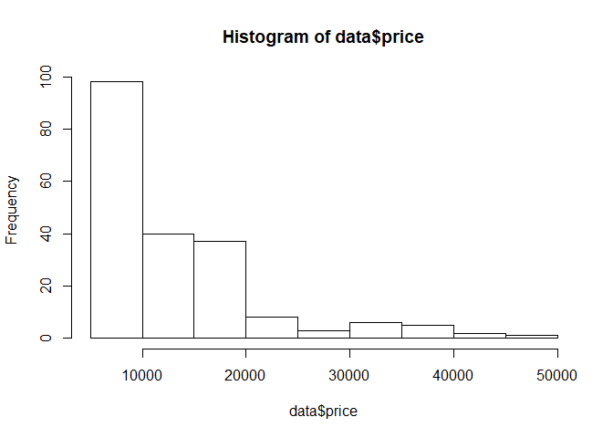
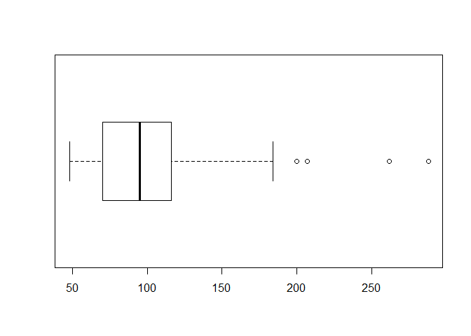
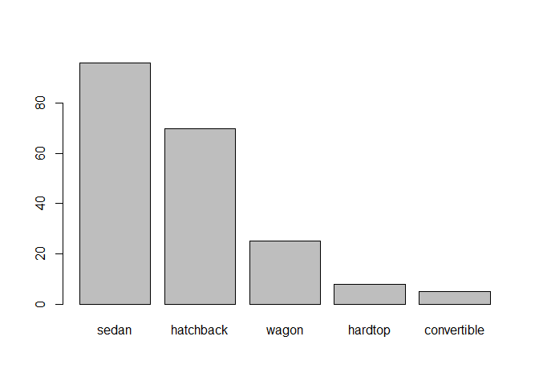
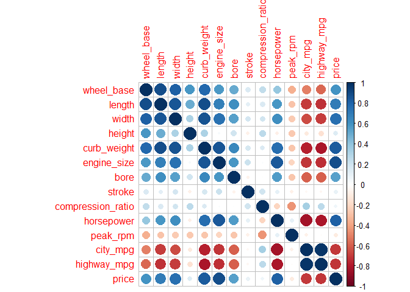
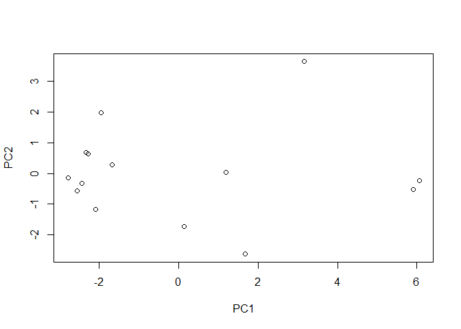
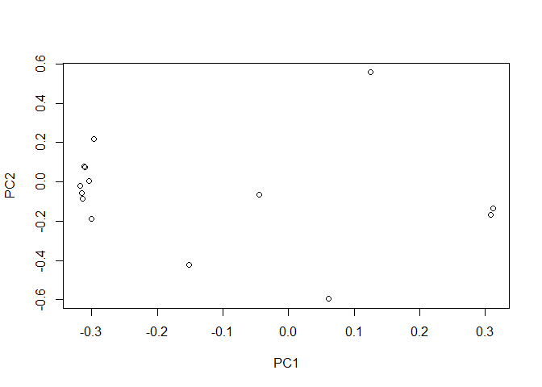
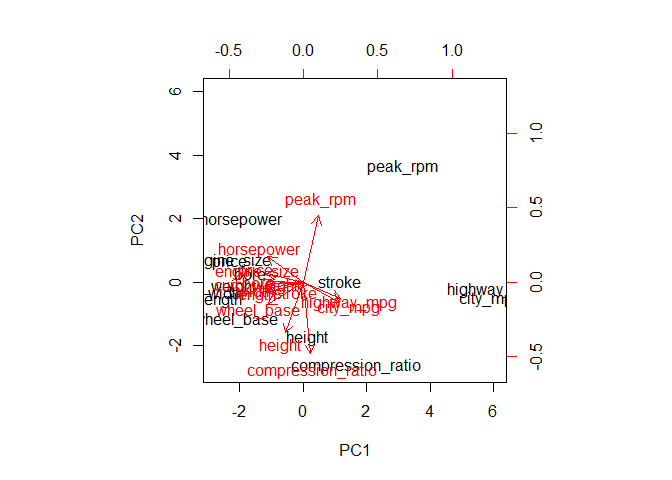

hw01-matthew-clagett.Rmd
================

Data Import
-----------

Loading necessary packages

``` r
library(readr)
library(dplyr)
```

    ## 
    ## Attaching package: 'dplyr'

    ## The following objects are masked from 'package:stats':
    ## 
    ##     filter, lag

    ## The following objects are masked from 'package:base':
    ## 
    ##     intersect, setdiff, setequal, union

``` r
library(corrplot)
```

    ## Warning: package 'corrplot' was built under R version 3.4.3

    ## corrplot 0.84 loaded

Downloading file into the working directory

``` r
url <- "http://archive.ics.uci.edu/ml/machine-learning-databases/autos/imports-85.data"
download.file(url, destfile = "imports-85.data")
```

Creating the column names

``` r
names <- c("symbolizing", "normalized_losses", "make", "fuel_type", "aspiration", "num_of_doors", "body_style", "drive_wheels", "engine_location", "wheel_base", "length", "width", "height", "curb_weight", "engine_type", "num_of_cylinders", "engine_size", "fuel_system", "bore", "stroke", "compression_ratio", "horsepower", "peak_rpm", "city_mpg", "highway_mpg", "price")
```

Classifications of columns

``` r
classes <- c("double","double","character","character","character","character","character","character","character", "double", "double", "double", "double", "integer", "character","character","integer","character", "double","double","double", "integer", "integer", "integer", "integer", "integer")
classesreadr <- "ddcccccccddddiccicdddiiiii"
length(classes)
```

    ## [1] 26

Importing the data with read.csv() using created column names and classes

``` r
data <- read.csv("imports-85.data", col.names=names, colClasses = classes, na.string = "?")
str(data)
```

    ## 'data.frame':    204 obs. of  26 variables:
    ##  $ symbolizing      : num  3 1 2 2 2 1 1 1 0 2 ...
    ##  $ normalized_losses: num  NA NA 164 164 NA 158 NA 158 NA 192 ...
    ##  $ make             : chr  "alfa-romero" "alfa-romero" "audi" "audi" ...
    ##  $ fuel_type        : chr  "gas" "gas" "gas" "gas" ...
    ##  $ aspiration       : chr  "std" "std" "std" "std" ...
    ##  $ num_of_doors     : chr  "two" "two" "four" "four" ...
    ##  $ body_style       : chr  "convertible" "hatchback" "sedan" "sedan" ...
    ##  $ drive_wheels     : chr  "rwd" "rwd" "fwd" "4wd" ...
    ##  $ engine_location  : chr  "front" "front" "front" "front" ...
    ##  $ wheel_base       : num  88.6 94.5 99.8 99.4 99.8 ...
    ##  $ length           : num  169 171 177 177 177 ...
    ##  $ width            : num  64.1 65.5 66.2 66.4 66.3 71.4 71.4 71.4 67.9 64.8 ...
    ##  $ height           : num  48.8 52.4 54.3 54.3 53.1 55.7 55.7 55.9 52 54.3 ...
    ##  $ curb_weight      : int  2548 2823 2337 2824 2507 2844 2954 3086 3053 2395 ...
    ##  $ engine_type      : chr  "dohc" "ohcv" "ohc" "ohc" ...
    ##  $ num_of_cylinders : chr  "four" "six" "four" "five" ...
    ##  $ engine_size      : int  130 152 109 136 136 136 136 131 131 108 ...
    ##  $ fuel_system      : chr  "mpfi" "mpfi" "mpfi" "mpfi" ...
    ##  $ bore             : num  3.47 2.68 3.19 3.19 3.19 3.19 3.19 3.13 3.13 3.5 ...
    ##  $ stroke           : num  2.68 3.47 3.4 3.4 3.4 3.4 3.4 3.4 3.4 2.8 ...
    ##  $ compression_ratio: num  9 9 10 8 8.5 8.5 8.5 8.3 7 8.8 ...
    ##  $ horsepower       : int  111 154 102 115 110 110 110 140 160 101 ...
    ##  $ peak_rpm         : int  5000 5000 5500 5500 5500 5500 5500 5500 5500 5800 ...
    ##  $ city_mpg         : int  21 19 24 18 19 19 19 17 16 23 ...
    ##  $ highway_mpg      : int  27 26 30 22 25 25 25 20 22 29 ...
    ##  $ price            : int  16500 16500 13950 17450 15250 17710 18920 23875 NA 16430 ...

Importing the data with read\_csv() using created column names and classes

``` r
data2 <- read_csv("imports-85.data", col_names = names , col_types = classesreadr, na = "?")
str(data2)
```

    ## Classes 'tbl_df', 'tbl' and 'data.frame':    205 obs. of  26 variables:
    ##  $ symbolizing      : num  3 3 1 2 2 2 1 1 1 0 ...
    ##  $ normalized_losses: num  NA NA NA 164 164 NA 158 NA 158 NA ...
    ##  $ make             : chr  "alfa-romero" "alfa-romero" "alfa-romero" "audi" ...
    ##  $ fuel_type        : chr  "gas" "gas" "gas" "gas" ...
    ##  $ aspiration       : chr  "std" "std" "std" "std" ...
    ##  $ num_of_doors     : chr  "two" "two" "two" "four" ...
    ##  $ body_style       : chr  "convertible" "convertible" "hatchback" "sedan" ...
    ##  $ drive_wheels     : chr  "rwd" "rwd" "rwd" "fwd" ...
    ##  $ engine_location  : chr  "front" "front" "front" "front" ...
    ##  $ wheel_base       : num  88.6 88.6 94.5 99.8 99.4 ...
    ##  $ length           : num  169 169 171 177 177 ...
    ##  $ width            : num  64.1 64.1 65.5 66.2 66.4 66.3 71.4 71.4 71.4 67.9 ...
    ##  $ height           : num  48.8 48.8 52.4 54.3 54.3 53.1 55.7 55.7 55.9 52 ...
    ##  $ curb_weight      : int  2548 2548 2823 2337 2824 2507 2844 2954 3086 3053 ...
    ##  $ engine_type      : chr  "dohc" "dohc" "ohcv" "ohc" ...
    ##  $ num_of_cylinders : chr  "four" "four" "six" "four" ...
    ##  $ engine_size      : int  130 130 152 109 136 136 136 136 131 131 ...
    ##  $ fuel_system      : chr  "mpfi" "mpfi" "mpfi" "mpfi" ...
    ##  $ bore             : num  3.47 3.47 2.68 3.19 3.19 3.19 3.19 3.19 3.13 3.13 ...
    ##  $ stroke           : num  2.68 2.68 3.47 3.4 3.4 3.4 3.4 3.4 3.4 3.4 ...
    ##  $ compression_ratio: num  9 9 9 10 8 8.5 8.5 8.5 8.3 7 ...
    ##  $ horsepower       : int  111 111 154 102 115 110 110 110 140 160 ...
    ##  $ peak_rpm         : int  5000 5000 5000 5500 5500 5500 5500 5500 5500 5500 ...
    ##  $ city_mpg         : int  21 21 19 24 18 19 19 19 17 16 ...
    ##  $ highway_mpg      : int  27 27 26 30 22 25 25 25 20 22 ...
    ##  $ price            : int  13495 16500 16500 13950 17450 15250 17710 18920 23875 NA ...
    ##  - attr(*, "spec")=List of 2
    ##   ..$ cols   :List of 26
    ##   .. ..$ symbolizing      : list()
    ##   .. .. ..- attr(*, "class")= chr  "collector_double" "collector"
    ##   .. ..$ normalized_losses: list()
    ##   .. .. ..- attr(*, "class")= chr  "collector_double" "collector"
    ##   .. ..$ make             : list()
    ##   .. .. ..- attr(*, "class")= chr  "collector_character" "collector"
    ##   .. ..$ fuel_type        : list()
    ##   .. .. ..- attr(*, "class")= chr  "collector_character" "collector"
    ##   .. ..$ aspiration       : list()
    ##   .. .. ..- attr(*, "class")= chr  "collector_character" "collector"
    ##   .. ..$ num_of_doors     : list()
    ##   .. .. ..- attr(*, "class")= chr  "collector_character" "collector"
    ##   .. ..$ body_style       : list()
    ##   .. .. ..- attr(*, "class")= chr  "collector_character" "collector"
    ##   .. ..$ drive_wheels     : list()
    ##   .. .. ..- attr(*, "class")= chr  "collector_character" "collector"
    ##   .. ..$ engine_location  : list()
    ##   .. .. ..- attr(*, "class")= chr  "collector_character" "collector"
    ##   .. ..$ wheel_base       : list()
    ##   .. .. ..- attr(*, "class")= chr  "collector_double" "collector"
    ##   .. ..$ length           : list()
    ##   .. .. ..- attr(*, "class")= chr  "collector_double" "collector"
    ##   .. ..$ width            : list()
    ##   .. .. ..- attr(*, "class")= chr  "collector_double" "collector"
    ##   .. ..$ height           : list()
    ##   .. .. ..- attr(*, "class")= chr  "collector_double" "collector"
    ##   .. ..$ curb_weight      : list()
    ##   .. .. ..- attr(*, "class")= chr  "collector_integer" "collector"
    ##   .. ..$ engine_type      : list()
    ##   .. .. ..- attr(*, "class")= chr  "collector_character" "collector"
    ##   .. ..$ num_of_cylinders : list()
    ##   .. .. ..- attr(*, "class")= chr  "collector_character" "collector"
    ##   .. ..$ engine_size      : list()
    ##   .. .. ..- attr(*, "class")= chr  "collector_integer" "collector"
    ##   .. ..$ fuel_system      : list()
    ##   .. .. ..- attr(*, "class")= chr  "collector_character" "collector"
    ##   .. ..$ bore             : list()
    ##   .. .. ..- attr(*, "class")= chr  "collector_double" "collector"
    ##   .. ..$ stroke           : list()
    ##   .. .. ..- attr(*, "class")= chr  "collector_double" "collector"
    ##   .. ..$ compression_ratio: list()
    ##   .. .. ..- attr(*, "class")= chr  "collector_double" "collector"
    ##   .. ..$ horsepower       : list()
    ##   .. .. ..- attr(*, "class")= chr  "collector_integer" "collector"
    ##   .. ..$ peak_rpm         : list()
    ##   .. .. ..- attr(*, "class")= chr  "collector_integer" "collector"
    ##   .. ..$ city_mpg         : list()
    ##   .. .. ..- attr(*, "class")= chr  "collector_integer" "collector"
    ##   .. ..$ highway_mpg      : list()
    ##   .. .. ..- attr(*, "class")= chr  "collector_integer" "collector"
    ##   .. ..$ price            : list()
    ##   .. .. ..- attr(*, "class")= chr  "collector_integer" "collector"
    ##   ..$ default: list()
    ##   .. ..- attr(*, "class")= chr  "collector_guess" "collector"
    ##   ..- attr(*, "class")= chr "col_spec"

Technical Questions about importing data
----------------------------------------

### a. If you don't provide a vector of column names, what happens to the column names of the imported data when you simply invoke read.csv('imports-85.data')?

The data frame's column names will default to the first row of the data.

### b. If you don't provide a vector of column names, what happens to the column names of the imported data when you invoke read.csv('imports-85.data', header = FALSE)?

The data frame's column names will default to dummy variables, labeled V1, V2, V3 ... etc

### c. When using the reading table functions, if you don't specify how missing values are codified, what happens to the data type of those columns that contain '?', e.g. price or num\_of\_doors?

Those that are supposed to be numerical are classified as factors

### d. Say you import imports-85.data in two different ways. In the first option you import the data without specifying the data type of each column. In the second option you do specify the data types. You may wonder whether both options return a data frame of the same memory size. You can actually use the function object.size() that provides an estimate of the memory that is being used to store an R object. Why is the data frame imported in the second option bigger (in terms of bytes) than the data frame imported in the first option?

### e. Say the object dat is the data frame produced when importing imports-85.data. What happens to the data values if you convert dat as an R matrix?

All values are converted to class character

Practice base plotting
======================

1.  Histogram of price with colored bars

``` r
hist(data$price)
```



1.  Boxplot of horsepower in horizontal orientation

``` r
?boxplot
```

    ## starting httpd help server ... done

``` r
boxplot(data$horsepower, horizontal=TRUE)
```



1.  Barplot of the frequencies of body\_style, arranged in decreasing order

``` r
barplot(table(data$body_style)[order(table(data$body_style), decreasing=TRUE)])
```

 Stars() plot of vehicles with turbo aspiration, using only variables wheel-base, length, width, height, and price

``` r
stars(filter(data, aspiration == "turbo")[c("wheel_base", "length", "width", "height", "price")])
```


Summaries
=========

### a. What is the mean price of fuel\_type gas cars? And what is the mean price of fuel\_type diesel cars? (removing missing values)

``` r
summarise(data, mean_price_gas = mean(filter(data, fuel_type == "gas")$price, na.rm=TRUE),
          mean_price_diesel = mean(filter(data, fuel_type == "diesel")$price, na.rm=TRUE))
```

    ##   mean_price_gas mean_price_diesel
    ## 1       12913.19          15838.15

### b. What is the make of the car with twelve num\_of\_cylinders?

``` r
data
```

    ##     symbolizing normalized_losses          make fuel_type aspiration
    ## 1             3                NA   alfa-romero       gas        std
    ## 2             1                NA   alfa-romero       gas        std
    ## 3             2               164          audi       gas        std
    ## 4             2               164          audi       gas        std
    ## 5             2                NA          audi       gas        std
    ## 6             1               158          audi       gas        std
    ## 7             1                NA          audi       gas        std
    ## 8             1               158          audi       gas      turbo
    ## 9             0                NA          audi       gas      turbo
    ## 10            2               192           bmw       gas        std
    ## 11            0               192           bmw       gas        std
    ## 12            0               188           bmw       gas        std
    ## 13            0               188           bmw       gas        std
    ## 14            1                NA           bmw       gas        std
    ## 15            0                NA           bmw       gas        std
    ## 16            0                NA           bmw       gas        std
    ## 17            0                NA           bmw       gas        std
    ## 18            2               121     chevrolet       gas        std
    ## 19            1                98     chevrolet       gas        std
    ## 20            0                81     chevrolet       gas        std
    ## 21            1               118         dodge       gas        std
    ## 22            1               118         dodge       gas        std
    ## 23            1               118         dodge       gas      turbo
    ## 24            1               148         dodge       gas        std
    ## 25            1               148         dodge       gas        std
    ## 26            1               148         dodge       gas        std
    ## 27            1               148         dodge       gas      turbo
    ## 28           -1               110         dodge       gas        std
    ## 29            3               145         dodge       gas      turbo
    ## 30            2               137         honda       gas        std
    ## 31            2               137         honda       gas        std
    ## 32            1               101         honda       gas        std
    ## 33            1               101         honda       gas        std
    ## 34            1               101         honda       gas        std
    ## 35            0               110         honda       gas        std
    ## 36            0                78         honda       gas        std
    ## 37            0               106         honda       gas        std
    ## 38            0               106         honda       gas        std
    ## 39            0                85         honda       gas        std
    ## 40            0                85         honda       gas        std
    ## 41            0                85         honda       gas        std
    ## 42            1               107         honda       gas        std
    ## 43            0                NA         isuzu       gas        std
    ## 44            1                NA         isuzu       gas        std
    ## 45            0                NA         isuzu       gas        std
    ## 46            2                NA         isuzu       gas        std
    ## 47            0               145        jaguar       gas        std
    ## 48            0                NA        jaguar       gas        std
    ## 49            0                NA        jaguar       gas        std
    ## 50            1               104         mazda       gas        std
    ## 51            1               104         mazda       gas        std
    ## 52            1               104         mazda       gas        std
    ## 53            1               113         mazda       gas        std
    ## 54            1               113         mazda       gas        std
    ## 55            3               150         mazda       gas        std
    ## 56            3               150         mazda       gas        std
    ## 57            3               150         mazda       gas        std
    ## 58            3               150         mazda       gas        std
    ## 59            1               129         mazda       gas        std
    ## 60            0               115         mazda       gas        std
    ## 61            1               129         mazda       gas        std
    ## 62            0               115         mazda       gas        std
    ## 63            0                NA         mazda    diesel        std
    ## 64            0               115         mazda       gas        std
    ## 65            0               118         mazda       gas        std
    ## 66            0                NA         mazda    diesel        std
    ## 67           -1                93 mercedes-benz    diesel      turbo
    ## 68           -1                93 mercedes-benz    diesel      turbo
    ## 69            0                93 mercedes-benz    diesel      turbo
    ## 70           -1                93 mercedes-benz    diesel      turbo
    ## 71           -1                NA mercedes-benz       gas        std
    ## 72            3               142 mercedes-benz       gas        std
    ## 73            0                NA mercedes-benz       gas        std
    ## 74            1                NA mercedes-benz       gas        std
    ## 75            1                NA       mercury       gas      turbo
    ## 76            2               161    mitsubishi       gas        std
    ## 77            2               161    mitsubishi       gas        std
    ## 78            2               161    mitsubishi       gas        std
    ## 79            1               161    mitsubishi       gas      turbo
    ## 80            3               153    mitsubishi       gas      turbo
    ## 81            3               153    mitsubishi       gas        std
    ## 82            3                NA    mitsubishi       gas      turbo
    ## 83            3                NA    mitsubishi       gas      turbo
    ## 84            3                NA    mitsubishi       gas      turbo
    ## 85            1               125    mitsubishi       gas        std
    ## 86            1               125    mitsubishi       gas        std
    ## 87            1               125    mitsubishi       gas      turbo
    ## 88           -1               137    mitsubishi       gas        std
    ## 89            1               128        nissan       gas        std
    ## 90            1               128        nissan    diesel        std
    ## 91            1               128        nissan       gas        std
    ## 92            1               122        nissan       gas        std
    ## 93            1               103        nissan       gas        std
    ## 94            1               128        nissan       gas        std
    ## 95            1               128        nissan       gas        std
    ## 96            1               122        nissan       gas        std
    ## 97            1               103        nissan       gas        std
    ## 98            2               168        nissan       gas        std
    ## 99            0               106        nissan       gas        std
    ## 100           0               106        nissan       gas        std
    ## 101           0               128        nissan       gas        std
    ## 102           0               108        nissan       gas        std
    ## 103           0               108        nissan       gas        std
    ## 104           3               194        nissan       gas        std
    ## 105           3               194        nissan       gas      turbo
    ## 106           1               231        nissan       gas        std
    ## 107           0               161        peugot       gas        std
    ## 108           0               161        peugot    diesel      turbo
    ## 109           0                NA        peugot       gas        std
    ## 110           0                NA        peugot    diesel      turbo
    ## 111           0               161        peugot       gas        std
    ## 112           0               161        peugot    diesel      turbo
    ## 113           0                NA        peugot       gas        std
    ## 114           0                NA        peugot    diesel      turbo
    ## 115           0               161        peugot       gas        std
    ## 116           0               161        peugot    diesel      turbo
    ## 117           0               161        peugot       gas      turbo
    ## 118           1               119      plymouth       gas        std
    ## 119           1               119      plymouth       gas      turbo
    ## 120           1               154      plymouth       gas        std
    ## 121           1               154      plymouth       gas        std
    ## 122           1               154      plymouth       gas        std
    ## 123          -1                74      plymouth       gas        std
    ## 124           3                NA      plymouth       gas      turbo
    ## 125           3               186       porsche       gas        std
    ## 126           3                NA       porsche       gas        std
    ## 127           3                NA       porsche       gas        std
    ## 128           3                NA       porsche       gas        std
    ## 129           1                NA       porsche       gas        std
    ## 130           0                NA       renault       gas        std
    ## 131           2                NA       renault       gas        std
    ## 132           3               150          saab       gas        std
    ## 133           2               104          saab       gas        std
    ## 134           3               150          saab       gas        std
    ## 135           2               104          saab       gas        std
    ## 136           3               150          saab       gas      turbo
    ## 137           2               104          saab       gas      turbo
    ## 138           2                83        subaru       gas        std
    ## 139           2                83        subaru       gas        std
    ## 140           2                83        subaru       gas        std
    ## 141           0               102        subaru       gas        std
    ## 142           0               102        subaru       gas        std
    ## 143           0               102        subaru       gas        std
    ## 144           0               102        subaru       gas        std
    ## 145           0               102        subaru       gas      turbo
    ## 146           0                89        subaru       gas        std
    ## 147           0                89        subaru       gas        std
    ## 148           0                85        subaru       gas        std
    ## 149           0                85        subaru       gas      turbo
    ## 150           1                87        toyota       gas        std
    ## 151           1                87        toyota       gas        std
    ## 152           1                74        toyota       gas        std
    ## 153           0                77        toyota       gas        std
    ## 154           0                81        toyota       gas        std
    ## 155           0                91        toyota       gas        std
    ## 156           0                91        toyota       gas        std
    ## 157           0                91        toyota       gas        std
    ## 158           0                91        toyota    diesel        std
    ## 159           0                91        toyota    diesel        std
    ## 160           0                91        toyota       gas        std
    ## 161           0                91        toyota       gas        std
    ## 162           0                91        toyota       gas        std
    ## 163           1               168        toyota       gas        std
    ## 164           1               168        toyota       gas        std
    ## 165           1               168        toyota       gas        std
    ## 166           1               168        toyota       gas        std
    ## 167           2               134        toyota       gas        std
    ## 168           2               134        toyota       gas        std
    ## 169           2               134        toyota       gas        std
    ## 170           2               134        toyota       gas        std
    ## 171           2               134        toyota       gas        std
    ## 172           2               134        toyota       gas        std
    ## 173          -1                65        toyota       gas        std
    ## 174          -1                65        toyota    diesel      turbo
    ## 175          -1                65        toyota       gas        std
    ## 176          -1                65        toyota       gas        std
    ## 177          -1                65        toyota       gas        std
    ## 178           3               197        toyota       gas        std
    ## 179           3               197        toyota       gas        std
    ## 180          -1                90        toyota       gas        std
    ## 181          -1                NA        toyota       gas        std
    ## 182           2               122    volkswagen    diesel        std
    ## 183           2               122    volkswagen       gas        std
    ## 184           2                94    volkswagen    diesel        std
    ## 185           2                94    volkswagen       gas        std
    ## 186           2                94    volkswagen       gas        std
    ## 187           2                94    volkswagen    diesel      turbo
    ## 188           2                94    volkswagen       gas        std
    ## 189           3                NA    volkswagen       gas        std
    ## 190           3               256    volkswagen       gas        std
    ## 191           0                NA    volkswagen       gas        std
    ## 192           0                NA    volkswagen    diesel      turbo
    ## 193           0                NA    volkswagen       gas        std
    ## 194          -2               103         volvo       gas        std
    ## 195          -1                74         volvo       gas        std
    ## 196          -2               103         volvo       gas        std
    ## 197          -1                74         volvo       gas        std
    ## 198          -2               103         volvo       gas      turbo
    ## 199          -1                74         volvo       gas      turbo
    ## 200          -1                95         volvo       gas        std
    ## 201          -1                95         volvo       gas      turbo
    ## 202          -1                95         volvo       gas        std
    ## 203          -1                95         volvo    diesel      turbo
    ## 204          -1                95         volvo       gas      turbo
    ##     num_of_doors  body_style drive_wheels engine_location wheel_base
    ## 1            two convertible          rwd           front       88.6
    ## 2            two   hatchback          rwd           front       94.5
    ## 3           four       sedan          fwd           front       99.8
    ## 4           four       sedan          4wd           front       99.4
    ## 5            two       sedan          fwd           front       99.8
    ## 6           four       sedan          fwd           front      105.8
    ## 7           four       wagon          fwd           front      105.8
    ## 8           four       sedan          fwd           front      105.8
    ## 9            two   hatchback          4wd           front       99.5
    ## 10           two       sedan          rwd           front      101.2
    ## 11          four       sedan          rwd           front      101.2
    ## 12           two       sedan          rwd           front      101.2
    ## 13          four       sedan          rwd           front      101.2
    ## 14          four       sedan          rwd           front      103.5
    ## 15          four       sedan          rwd           front      103.5
    ## 16           two       sedan          rwd           front      103.5
    ## 17          four       sedan          rwd           front      110.0
    ## 18           two   hatchback          fwd           front       88.4
    ## 19           two   hatchback          fwd           front       94.5
    ## 20          four       sedan          fwd           front       94.5
    ## 21           two   hatchback          fwd           front       93.7
    ## 22           two   hatchback          fwd           front       93.7
    ## 23           two   hatchback          fwd           front       93.7
    ## 24          four   hatchback          fwd           front       93.7
    ## 25          four       sedan          fwd           front       93.7
    ## 26          four       sedan          fwd           front       93.7
    ## 27          <NA>       sedan          fwd           front       93.7
    ## 28          four       wagon          fwd           front      103.3
    ## 29           two   hatchback          fwd           front       95.9
    ## 30           two   hatchback          fwd           front       86.6
    ## 31           two   hatchback          fwd           front       86.6
    ## 32           two   hatchback          fwd           front       93.7
    ## 33           two   hatchback          fwd           front       93.7
    ## 34           two   hatchback          fwd           front       93.7
    ## 35          four       sedan          fwd           front       96.5
    ## 36          four       wagon          fwd           front       96.5
    ## 37           two   hatchback          fwd           front       96.5
    ## 38           two   hatchback          fwd           front       96.5
    ## 39          four       sedan          fwd           front       96.5
    ## 40          four       sedan          fwd           front       96.5
    ## 41          four       sedan          fwd           front       96.5
    ## 42           two       sedan          fwd           front       96.5
    ## 43          four       sedan          rwd           front       94.3
    ## 44           two       sedan          fwd           front       94.5
    ## 45          four       sedan          fwd           front       94.5
    ## 46           two   hatchback          rwd           front       96.0
    ## 47          four       sedan          rwd           front      113.0
    ## 48          four       sedan          rwd           front      113.0
    ## 49           two       sedan          rwd           front      102.0
    ## 50           two   hatchback          fwd           front       93.1
    ## 51           two   hatchback          fwd           front       93.1
    ## 52           two   hatchback          fwd           front       93.1
    ## 53          four       sedan          fwd           front       93.1
    ## 54          four       sedan          fwd           front       93.1
    ## 55           two   hatchback          rwd           front       95.3
    ## 56           two   hatchback          rwd           front       95.3
    ## 57           two   hatchback          rwd           front       95.3
    ## 58           two   hatchback          rwd           front       95.3
    ## 59           two   hatchback          fwd           front       98.8
    ## 60          four       sedan          fwd           front       98.8
    ## 61           two   hatchback          fwd           front       98.8
    ## 62          four       sedan          fwd           front       98.8
    ## 63          <NA>       sedan          fwd           front       98.8
    ## 64          four   hatchback          fwd           front       98.8
    ## 65          four       sedan          rwd           front      104.9
    ## 66          four       sedan          rwd           front      104.9
    ## 67          four       sedan          rwd           front      110.0
    ## 68          four       wagon          rwd           front      110.0
    ## 69           two     hardtop          rwd           front      106.7
    ## 70          four       sedan          rwd           front      115.6
    ## 71          four       sedan          rwd           front      115.6
    ## 72           two convertible          rwd           front       96.6
    ## 73          four       sedan          rwd           front      120.9
    ## 74           two     hardtop          rwd           front      112.0
    ## 75           two   hatchback          rwd           front      102.7
    ## 76           two   hatchback          fwd           front       93.7
    ## 77           two   hatchback          fwd           front       93.7
    ## 78           two   hatchback          fwd           front       93.7
    ## 79           two   hatchback          fwd           front       93.0
    ## 80           two   hatchback          fwd           front       96.3
    ## 81           two   hatchback          fwd           front       96.3
    ## 82           two   hatchback          fwd           front       95.9
    ## 83           two   hatchback          fwd           front       95.9
    ## 84           two   hatchback          fwd           front       95.9
    ## 85          four       sedan          fwd           front       96.3
    ## 86          four       sedan          fwd           front       96.3
    ## 87          four       sedan          fwd           front       96.3
    ## 88          four       sedan          fwd           front       96.3
    ## 89           two       sedan          fwd           front       94.5
    ## 90           two       sedan          fwd           front       94.5
    ## 91           two       sedan          fwd           front       94.5
    ## 92          four       sedan          fwd           front       94.5
    ## 93          four       wagon          fwd           front       94.5
    ## 94           two       sedan          fwd           front       94.5
    ## 95           two   hatchback          fwd           front       94.5
    ## 96          four       sedan          fwd           front       94.5
    ## 97          four       wagon          fwd           front       94.5
    ## 98           two     hardtop          fwd           front       95.1
    ## 99          four   hatchback          fwd           front       97.2
    ## 100         four       sedan          fwd           front       97.2
    ## 101         four       sedan          fwd           front      100.4
    ## 102         four       wagon          fwd           front      100.4
    ## 103         four       sedan          fwd           front      100.4
    ## 104          two   hatchback          rwd           front       91.3
    ## 105          two   hatchback          rwd           front       91.3
    ## 106          two   hatchback          rwd           front       99.2
    ## 107         four       sedan          rwd           front      107.9
    ## 108         four       sedan          rwd           front      107.9
    ## 109         four       wagon          rwd           front      114.2
    ## 110         four       wagon          rwd           front      114.2
    ## 111         four       sedan          rwd           front      107.9
    ## 112         four       sedan          rwd           front      107.9
    ## 113         four       wagon          rwd           front      114.2
    ## 114         four       wagon          rwd           front      114.2
    ## 115         four       sedan          rwd           front      107.9
    ## 116         four       sedan          rwd           front      107.9
    ## 117         four       sedan          rwd           front      108.0
    ## 118          two   hatchback          fwd           front       93.7
    ## 119          two   hatchback          fwd           front       93.7
    ## 120         four   hatchback          fwd           front       93.7
    ## 121         four       sedan          fwd           front       93.7
    ## 122         four       sedan          fwd           front       93.7
    ## 123         four       wagon          fwd           front      103.3
    ## 124          two   hatchback          rwd           front       95.9
    ## 125          two   hatchback          rwd           front       94.5
    ## 126          two     hardtop          rwd            rear       89.5
    ## 127          two     hardtop          rwd            rear       89.5
    ## 128          two convertible          rwd            rear       89.5
    ## 129          two   hatchback          rwd           front       98.4
    ## 130         four       wagon          fwd           front       96.1
    ## 131          two   hatchback          fwd           front       96.1
    ## 132          two   hatchback          fwd           front       99.1
    ## 133         four       sedan          fwd           front       99.1
    ## 134          two   hatchback          fwd           front       99.1
    ## 135         four       sedan          fwd           front       99.1
    ## 136          two   hatchback          fwd           front       99.1
    ## 137         four       sedan          fwd           front       99.1
    ## 138          two   hatchback          fwd           front       93.7
    ## 139          two   hatchback          fwd           front       93.7
    ## 140          two   hatchback          4wd           front       93.3
    ## 141         four       sedan          fwd           front       97.2
    ## 142         four       sedan          fwd           front       97.2
    ## 143         four       sedan          fwd           front       97.2
    ## 144         four       sedan          4wd           front       97.0
    ## 145         four       sedan          4wd           front       97.0
    ## 146         four       wagon          fwd           front       97.0
    ## 147         four       wagon          fwd           front       97.0
    ## 148         four       wagon          4wd           front       96.9
    ## 149         four       wagon          4wd           front       96.9
    ## 150          two   hatchback          fwd           front       95.7
    ## 151          two   hatchback          fwd           front       95.7
    ## 152         four   hatchback          fwd           front       95.7
    ## 153         four       wagon          fwd           front       95.7
    ## 154         four       wagon          4wd           front       95.7
    ## 155         four       wagon          4wd           front       95.7
    ## 156         four       sedan          fwd           front       95.7
    ## 157         four   hatchback          fwd           front       95.7
    ## 158         four       sedan          fwd           front       95.7
    ## 159         four   hatchback          fwd           front       95.7
    ## 160         four       sedan          fwd           front       95.7
    ## 161         four   hatchback          fwd           front       95.7
    ## 162         four       sedan          fwd           front       95.7
    ## 163          two       sedan          rwd           front       94.5
    ## 164          two   hatchback          rwd           front       94.5
    ## 165          two       sedan          rwd           front       94.5
    ## 166          two   hatchback          rwd           front       94.5
    ## 167          two     hardtop          rwd           front       98.4
    ## 168          two     hardtop          rwd           front       98.4
    ## 169          two   hatchback          rwd           front       98.4
    ## 170          two     hardtop          rwd           front       98.4
    ## 171          two   hatchback          rwd           front       98.4
    ## 172          two convertible          rwd           front       98.4
    ## 173         four       sedan          fwd           front      102.4
    ## 174         four       sedan          fwd           front      102.4
    ## 175         four   hatchback          fwd           front      102.4
    ## 176         four       sedan          fwd           front      102.4
    ## 177         four   hatchback          fwd           front      102.4
    ## 178          two   hatchback          rwd           front      102.9
    ## 179          two   hatchback          rwd           front      102.9
    ## 180         four       sedan          rwd           front      104.5
    ## 181         four       wagon          rwd           front      104.5
    ## 182          two       sedan          fwd           front       97.3
    ## 183          two       sedan          fwd           front       97.3
    ## 184         four       sedan          fwd           front       97.3
    ## 185         four       sedan          fwd           front       97.3
    ## 186         four       sedan          fwd           front       97.3
    ## 187         four       sedan          fwd           front       97.3
    ## 188         four       sedan          fwd           front       97.3
    ## 189          two convertible          fwd           front       94.5
    ## 190          two   hatchback          fwd           front       94.5
    ## 191         four       sedan          fwd           front      100.4
    ## 192         four       sedan          fwd           front      100.4
    ## 193         four       wagon          fwd           front      100.4
    ## 194         four       sedan          rwd           front      104.3
    ## 195         four       wagon          rwd           front      104.3
    ## 196         four       sedan          rwd           front      104.3
    ## 197         four       wagon          rwd           front      104.3
    ## 198         four       sedan          rwd           front      104.3
    ## 199         four       wagon          rwd           front      104.3
    ## 200         four       sedan          rwd           front      109.1
    ## 201         four       sedan          rwd           front      109.1
    ## 202         four       sedan          rwd           front      109.1
    ## 203         four       sedan          rwd           front      109.1
    ## 204         four       sedan          rwd           front      109.1
    ##     length width height curb_weight engine_type num_of_cylinders
    ## 1    168.8  64.1   48.8        2548        dohc             four
    ## 2    171.2  65.5   52.4        2823        ohcv              six
    ## 3    176.6  66.2   54.3        2337         ohc             four
    ## 4    176.6  66.4   54.3        2824         ohc             five
    ## 5    177.3  66.3   53.1        2507         ohc             five
    ## 6    192.7  71.4   55.7        2844         ohc             five
    ## 7    192.7  71.4   55.7        2954         ohc             five
    ## 8    192.7  71.4   55.9        3086         ohc             five
    ## 9    178.2  67.9   52.0        3053         ohc             five
    ## 10   176.8  64.8   54.3        2395         ohc             four
    ## 11   176.8  64.8   54.3        2395         ohc             four
    ## 12   176.8  64.8   54.3        2710         ohc              six
    ## 13   176.8  64.8   54.3        2765         ohc              six
    ## 14   189.0  66.9   55.7        3055         ohc              six
    ## 15   189.0  66.9   55.7        3230         ohc              six
    ## 16   193.8  67.9   53.7        3380         ohc              six
    ## 17   197.0  70.9   56.3        3505         ohc              six
    ## 18   141.1  60.3   53.2        1488           l            three
    ## 19   155.9  63.6   52.0        1874         ohc             four
    ## 20   158.8  63.6   52.0        1909         ohc             four
    ## 21   157.3  63.8   50.8        1876         ohc             four
    ## 22   157.3  63.8   50.8        1876         ohc             four
    ## 23   157.3  63.8   50.8        2128         ohc             four
    ## 24   157.3  63.8   50.6        1967         ohc             four
    ## 25   157.3  63.8   50.6        1989         ohc             four
    ## 26   157.3  63.8   50.6        1989         ohc             four
    ## 27   157.3  63.8   50.6        2191         ohc             four
    ## 28   174.6  64.6   59.8        2535         ohc             four
    ## 29   173.2  66.3   50.2        2811         ohc             four
    ## 30   144.6  63.9   50.8        1713         ohc             four
    ## 31   144.6  63.9   50.8        1819         ohc             four
    ## 32   150.0  64.0   52.6        1837         ohc             four
    ## 33   150.0  64.0   52.6        1940         ohc             four
    ## 34   150.0  64.0   52.6        1956         ohc             four
    ## 35   163.4  64.0   54.5        2010         ohc             four
    ## 36   157.1  63.9   58.3        2024         ohc             four
    ## 37   167.5  65.2   53.3        2236         ohc             four
    ## 38   167.5  65.2   53.3        2289         ohc             four
    ## 39   175.4  65.2   54.1        2304         ohc             four
    ## 40   175.4  62.5   54.1        2372         ohc             four
    ## 41   175.4  65.2   54.1        2465         ohc             four
    ## 42   169.1  66.0   51.0        2293         ohc             four
    ## 43   170.7  61.8   53.5        2337         ohc             four
    ## 44   155.9  63.6   52.0        1874         ohc             four
    ## 45   155.9  63.6   52.0        1909         ohc             four
    ## 46   172.6  65.2   51.4        2734         ohc             four
    ## 47   199.6  69.6   52.8        4066        dohc              six
    ## 48   199.6  69.6   52.8        4066        dohc              six
    ## 49   191.7  70.6   47.8        3950        ohcv           twelve
    ## 50   159.1  64.2   54.1        1890         ohc             four
    ## 51   159.1  64.2   54.1        1900         ohc             four
    ## 52   159.1  64.2   54.1        1905         ohc             four
    ## 53   166.8  64.2   54.1        1945         ohc             four
    ## 54   166.8  64.2   54.1        1950         ohc             four
    ## 55   169.0  65.7   49.6        2380       rotor              two
    ## 56   169.0  65.7   49.6        2380       rotor              two
    ## 57   169.0  65.7   49.6        2385       rotor              two
    ## 58   169.0  65.7   49.6        2500       rotor              two
    ## 59   177.8  66.5   53.7        2385         ohc             four
    ## 60   177.8  66.5   55.5        2410         ohc             four
    ## 61   177.8  66.5   53.7        2385         ohc             four
    ## 62   177.8  66.5   55.5        2410         ohc             four
    ## 63   177.8  66.5   55.5        2443         ohc             four
    ## 64   177.8  66.5   55.5        2425         ohc             four
    ## 65   175.0  66.1   54.4        2670         ohc             four
    ## 66   175.0  66.1   54.4        2700         ohc             four
    ## 67   190.9  70.3   56.5        3515         ohc             five
    ## 68   190.9  70.3   58.7        3750         ohc             five
    ## 69   187.5  70.3   54.9        3495         ohc             five
    ## 70   202.6  71.7   56.3        3770         ohc             five
    ## 71   202.6  71.7   56.5        3740        ohcv            eight
    ## 72   180.3  70.5   50.8        3685        ohcv            eight
    ## 73   208.1  71.7   56.7        3900        ohcv            eight
    ## 74   199.2  72.0   55.4        3715        ohcv            eight
    ## 75   178.4  68.0   54.8        2910         ohc             four
    ## 76   157.3  64.4   50.8        1918         ohc             four
    ## 77   157.3  64.4   50.8        1944         ohc             four
    ## 78   157.3  64.4   50.8        2004         ohc             four
    ## 79   157.3  63.8   50.8        2145         ohc             four
    ## 80   173.0  65.4   49.4        2370         ohc             four
    ## 81   173.0  65.4   49.4        2328         ohc             four
    ## 82   173.2  66.3   50.2        2833         ohc             four
    ## 83   173.2  66.3   50.2        2921         ohc             four
    ## 84   173.2  66.3   50.2        2926         ohc             four
    ## 85   172.4  65.4   51.6        2365         ohc             four
    ## 86   172.4  65.4   51.6        2405         ohc             four
    ## 87   172.4  65.4   51.6        2403         ohc             four
    ## 88   172.4  65.4   51.6        2403         ohc             four
    ## 89   165.3  63.8   54.5        1889         ohc             four
    ## 90   165.3  63.8   54.5        2017         ohc             four
    ## 91   165.3  63.8   54.5        1918         ohc             four
    ## 92   165.3  63.8   54.5        1938         ohc             four
    ## 93   170.2  63.8   53.5        2024         ohc             four
    ## 94   165.3  63.8   54.5        1951         ohc             four
    ## 95   165.6  63.8   53.3        2028         ohc             four
    ## 96   165.3  63.8   54.5        1971         ohc             four
    ## 97   170.2  63.8   53.5        2037         ohc             four
    ## 98   162.4  63.8   53.3        2008         ohc             four
    ## 99   173.4  65.2   54.7        2324         ohc             four
    ## 100  173.4  65.2   54.7        2302         ohc             four
    ## 101  181.7  66.5   55.1        3095        ohcv              six
    ## 102  184.6  66.5   56.1        3296        ohcv              six
    ## 103  184.6  66.5   55.1        3060        ohcv              six
    ## 104  170.7  67.9   49.7        3071        ohcv              six
    ## 105  170.7  67.9   49.7        3139        ohcv              six
    ## 106  178.5  67.9   49.7        3139        ohcv              six
    ## 107  186.7  68.4   56.7        3020           l             four
    ## 108  186.7  68.4   56.7        3197           l             four
    ## 109  198.9  68.4   58.7        3230           l             four
    ## 110  198.9  68.4   58.7        3430           l             four
    ## 111  186.7  68.4   56.7        3075           l             four
    ## 112  186.7  68.4   56.7        3252           l             four
    ## 113  198.9  68.4   56.7        3285           l             four
    ## 114  198.9  68.4   58.7        3485           l             four
    ## 115  186.7  68.4   56.7        3075           l             four
    ## 116  186.7  68.4   56.7        3252           l             four
    ## 117  186.7  68.3   56.0        3130           l             four
    ## 118  157.3  63.8   50.8        1918         ohc             four
    ## 119  157.3  63.8   50.8        2128         ohc             four
    ## 120  157.3  63.8   50.6        1967         ohc             four
    ## 121  167.3  63.8   50.8        1989         ohc             four
    ## 122  167.3  63.8   50.8        2191         ohc             four
    ## 123  174.6  64.6   59.8        2535         ohc             four
    ## 124  173.2  66.3   50.2        2818         ohc             four
    ## 125  168.9  68.3   50.2        2778         ohc             four
    ## 126  168.9  65.0   51.6        2756        ohcf              six
    ## 127  168.9  65.0   51.6        2756        ohcf              six
    ## 128  168.9  65.0   51.6        2800        ohcf              six
    ## 129  175.7  72.3   50.5        3366       dohcv            eight
    ## 130  181.5  66.5   55.2        2579         ohc             four
    ## 131  176.8  66.6   50.5        2460         ohc             four
    ## 132  186.6  66.5   56.1        2658         ohc             four
    ## 133  186.6  66.5   56.1        2695         ohc             four
    ## 134  186.6  66.5   56.1        2707         ohc             four
    ## 135  186.6  66.5   56.1        2758         ohc             four
    ## 136  186.6  66.5   56.1        2808        dohc             four
    ## 137  186.6  66.5   56.1        2847        dohc             four
    ## 138  156.9  63.4   53.7        2050        ohcf             four
    ## 139  157.9  63.6   53.7        2120        ohcf             four
    ## 140  157.3  63.8   55.7        2240        ohcf             four
    ## 141  172.0  65.4   52.5        2145        ohcf             four
    ## 142  172.0  65.4   52.5        2190        ohcf             four
    ## 143  172.0  65.4   52.5        2340        ohcf             four
    ## 144  172.0  65.4   54.3        2385        ohcf             four
    ## 145  172.0  65.4   54.3        2510        ohcf             four
    ## 146  173.5  65.4   53.0        2290        ohcf             four
    ## 147  173.5  65.4   53.0        2455        ohcf             four
    ## 148  173.6  65.4   54.9        2420        ohcf             four
    ## 149  173.6  65.4   54.9        2650        ohcf             four
    ## 150  158.7  63.6   54.5        1985         ohc             four
    ## 151  158.7  63.6   54.5        2040         ohc             four
    ## 152  158.7  63.6   54.5        2015         ohc             four
    ## 153  169.7  63.6   59.1        2280         ohc             four
    ## 154  169.7  63.6   59.1        2290         ohc             four
    ## 155  169.7  63.6   59.1        3110         ohc             four
    ## 156  166.3  64.4   53.0        2081         ohc             four
    ## 157  166.3  64.4   52.8        2109         ohc             four
    ## 158  166.3  64.4   53.0        2275         ohc             four
    ## 159  166.3  64.4   52.8        2275         ohc             four
    ## 160  166.3  64.4   53.0        2094         ohc             four
    ## 161  166.3  64.4   52.8        2122         ohc             four
    ## 162  166.3  64.4   52.8        2140         ohc             four
    ## 163  168.7  64.0   52.6        2169         ohc             four
    ## 164  168.7  64.0   52.6        2204         ohc             four
    ## 165  168.7  64.0   52.6        2265        dohc             four
    ## 166  168.7  64.0   52.6        2300        dohc             four
    ## 167  176.2  65.6   52.0        2540         ohc             four
    ## 168  176.2  65.6   52.0        2536         ohc             four
    ## 169  176.2  65.6   52.0        2551         ohc             four
    ## 170  176.2  65.6   52.0        2679         ohc             four
    ## 171  176.2  65.6   52.0        2714         ohc             four
    ## 172  176.2  65.6   53.0        2975         ohc             four
    ## 173  175.6  66.5   54.9        2326         ohc             four
    ## 174  175.6  66.5   54.9        2480         ohc             four
    ## 175  175.6  66.5   53.9        2414         ohc             four
    ## 176  175.6  66.5   54.9        2414         ohc             four
    ## 177  175.6  66.5   53.9        2458         ohc             four
    ## 178  183.5  67.7   52.0        2976        dohc              six
    ## 179  183.5  67.7   52.0        3016        dohc              six
    ## 180  187.8  66.5   54.1        3131        dohc              six
    ## 181  187.8  66.5   54.1        3151        dohc              six
    ## 182  171.7  65.5   55.7        2261         ohc             four
    ## 183  171.7  65.5   55.7        2209         ohc             four
    ## 184  171.7  65.5   55.7        2264         ohc             four
    ## 185  171.7  65.5   55.7        2212         ohc             four
    ## 186  171.7  65.5   55.7        2275         ohc             four
    ## 187  171.7  65.5   55.7        2319         ohc             four
    ## 188  171.7  65.5   55.7        2300         ohc             four
    ## 189  159.3  64.2   55.6        2254         ohc             four
    ## 190  165.7  64.0   51.4        2221         ohc             four
    ## 191  180.2  66.9   55.1        2661         ohc             five
    ## 192  180.2  66.9   55.1        2579         ohc             four
    ## 193  183.1  66.9   55.1        2563         ohc             four
    ## 194  188.8  67.2   56.2        2912         ohc             four
    ## 195  188.8  67.2   57.5        3034         ohc             four
    ## 196  188.8  67.2   56.2        2935         ohc             four
    ## 197  188.8  67.2   57.5        3042         ohc             four
    ## 198  188.8  67.2   56.2        3045         ohc             four
    ## 199  188.8  67.2   57.5        3157         ohc             four
    ## 200  188.8  68.9   55.5        2952         ohc             four
    ## 201  188.8  68.8   55.5        3049         ohc             four
    ## 202  188.8  68.9   55.5        3012        ohcv              six
    ## 203  188.8  68.9   55.5        3217         ohc              six
    ## 204  188.8  68.9   55.5        3062         ohc             four
    ##     engine_size fuel_system bore stroke compression_ratio horsepower
    ## 1           130        mpfi 3.47   2.68              9.00        111
    ## 2           152        mpfi 2.68   3.47              9.00        154
    ## 3           109        mpfi 3.19   3.40             10.00        102
    ## 4           136        mpfi 3.19   3.40              8.00        115
    ## 5           136        mpfi 3.19   3.40              8.50        110
    ## 6           136        mpfi 3.19   3.40              8.50        110
    ## 7           136        mpfi 3.19   3.40              8.50        110
    ## 8           131        mpfi 3.13   3.40              8.30        140
    ## 9           131        mpfi 3.13   3.40              7.00        160
    ## 10          108        mpfi 3.50   2.80              8.80        101
    ## 11          108        mpfi 3.50   2.80              8.80        101
    ## 12          164        mpfi 3.31   3.19              9.00        121
    ## 13          164        mpfi 3.31   3.19              9.00        121
    ## 14          164        mpfi 3.31   3.19              9.00        121
    ## 15          209        mpfi 3.62   3.39              8.00        182
    ## 16          209        mpfi 3.62   3.39              8.00        182
    ## 17          209        mpfi 3.62   3.39              8.00        182
    ## 18           61        2bbl 2.91   3.03              9.50         48
    ## 19           90        2bbl 3.03   3.11              9.60         70
    ## 20           90        2bbl 3.03   3.11              9.60         70
    ## 21           90        2bbl 2.97   3.23              9.41         68
    ## 22           90        2bbl 2.97   3.23              9.40         68
    ## 23           98        mpfi 3.03   3.39              7.60        102
    ## 24           90        2bbl 2.97   3.23              9.40         68
    ## 25           90        2bbl 2.97   3.23              9.40         68
    ## 26           90        2bbl 2.97   3.23              9.40         68
    ## 27           98        mpfi 3.03   3.39              7.60        102
    ## 28          122        2bbl 3.34   3.46              8.50         88
    ## 29          156         mfi 3.60   3.90              7.00        145
    ## 30           92        1bbl 2.91   3.41              9.60         58
    ## 31           92        1bbl 2.91   3.41              9.20         76
    ## 32           79        1bbl 2.91   3.07             10.10         60
    ## 33           92        1bbl 2.91   3.41              9.20         76
    ## 34           92        1bbl 2.91   3.41              9.20         76
    ## 35           92        1bbl 2.91   3.41              9.20         76
    ## 36           92        1bbl 2.92   3.41              9.20         76
    ## 37          110        1bbl 3.15   3.58              9.00         86
    ## 38          110        1bbl 3.15   3.58              9.00         86
    ## 39          110        1bbl 3.15   3.58              9.00         86
    ## 40          110        1bbl 3.15   3.58              9.00         86
    ## 41          110        mpfi 3.15   3.58              9.00        101
    ## 42          110        2bbl 3.15   3.58              9.10        100
    ## 43          111        2bbl 3.31   3.23              8.50         78
    ## 44           90        2bbl 3.03   3.11              9.60         70
    ## 45           90        2bbl 3.03   3.11              9.60         70
    ## 46          119        spfi 3.43   3.23              9.20         90
    ## 47          258        mpfi 3.63   4.17              8.10        176
    ## 48          258        mpfi 3.63   4.17              8.10        176
    ## 49          326        mpfi 3.54   2.76             11.50        262
    ## 50           91        2bbl 3.03   3.15              9.00         68
    ## 51           91        2bbl 3.03   3.15              9.00         68
    ## 52           91        2bbl 3.03   3.15              9.00         68
    ## 53           91        2bbl 3.03   3.15              9.00         68
    ## 54           91        2bbl 3.08   3.15              9.00         68
    ## 55           70        4bbl   NA     NA              9.40        101
    ## 56           70        4bbl   NA     NA              9.40        101
    ## 57           70        4bbl   NA     NA              9.40        101
    ## 58           80        mpfi   NA     NA              9.40        135
    ## 59          122        2bbl 3.39   3.39              8.60         84
    ## 60          122        2bbl 3.39   3.39              8.60         84
    ## 61          122        2bbl 3.39   3.39              8.60         84
    ## 62          122        2bbl 3.39   3.39              8.60         84
    ## 63          122         idi 3.39   3.39             22.70         64
    ## 64          122        2bbl 3.39   3.39              8.60         84
    ## 65          140        mpfi 3.76   3.16              8.00        120
    ## 66          134         idi 3.43   3.64             22.00         72
    ## 67          183         idi 3.58   3.64             21.50        123
    ## 68          183         idi 3.58   3.64             21.50        123
    ## 69          183         idi 3.58   3.64             21.50        123
    ## 70          183         idi 3.58   3.64             21.50        123
    ## 71          234        mpfi 3.46   3.10              8.30        155
    ## 72          234        mpfi 3.46   3.10              8.30        155
    ## 73          308        mpfi 3.80   3.35              8.00        184
    ## 74          304        mpfi 3.80   3.35              8.00        184
    ## 75          140        mpfi 3.78   3.12              8.00        175
    ## 76           92        2bbl 2.97   3.23              9.40         68
    ## 77           92        2bbl 2.97   3.23              9.40         68
    ## 78           92        2bbl 2.97   3.23              9.40         68
    ## 79           98        spdi 3.03   3.39              7.60        102
    ## 80          110        spdi 3.17   3.46              7.50        116
    ## 81          122        2bbl 3.35   3.46              8.50         88
    ## 82          156        spdi 3.58   3.86              7.00        145
    ## 83          156        spdi 3.59   3.86              7.00        145
    ## 84          156        spdi 3.59   3.86              7.00        145
    ## 85          122        2bbl 3.35   3.46              8.50         88
    ## 86          122        2bbl 3.35   3.46              8.50         88
    ## 87          110        spdi 3.17   3.46              7.50        116
    ## 88          110        spdi 3.17   3.46              7.50        116
    ## 89           97        2bbl 3.15   3.29              9.40         69
    ## 90          103         idi 2.99   3.47             21.90         55
    ## 91           97        2bbl 3.15   3.29              9.40         69
    ## 92           97        2bbl 3.15   3.29              9.40         69
    ## 93           97        2bbl 3.15   3.29              9.40         69
    ## 94           97        2bbl 3.15   3.29              9.40         69
    ## 95           97        2bbl 3.15   3.29              9.40         69
    ## 96           97        2bbl 3.15   3.29              9.40         69
    ## 97           97        2bbl 3.15   3.29              9.40         69
    ## 98           97        2bbl 3.15   3.29              9.40         69
    ## 99          120        2bbl 3.33   3.47              8.50         97
    ## 100         120        2bbl 3.33   3.47              8.50         97
    ## 101         181        mpfi 3.43   3.27              9.00        152
    ## 102         181        mpfi 3.43   3.27              9.00        152
    ## 103         181        mpfi 3.43   3.27              9.00        152
    ## 104         181        mpfi 3.43   3.27              9.00        160
    ## 105         181        mpfi 3.43   3.27              7.80        200
    ## 106         181        mpfi 3.43   3.27              9.00        160
    ## 107         120        mpfi 3.46   3.19              8.40         97
    ## 108         152         idi 3.70   3.52             21.00         95
    ## 109         120        mpfi 3.46   3.19              8.40         97
    ## 110         152         idi 3.70   3.52             21.00         95
    ## 111         120        mpfi 3.46   2.19              8.40         95
    ## 112         152         idi 3.70   3.52             21.00         95
    ## 113         120        mpfi 3.46   2.19              8.40         95
    ## 114         152         idi 3.70   3.52             21.00         95
    ## 115         120        mpfi 3.46   3.19              8.40         97
    ## 116         152         idi 3.70   3.52             21.00         95
    ## 117         134        mpfi 3.61   3.21              7.00        142
    ## 118          90        2bbl 2.97   3.23              9.40         68
    ## 119          98        spdi 3.03   3.39              7.60        102
    ## 120          90        2bbl 2.97   3.23              9.40         68
    ## 121          90        2bbl 2.97   3.23              9.40         68
    ## 122          98        2bbl 2.97   3.23              9.40         68
    ## 123         122        2bbl 3.35   3.46              8.50         88
    ## 124         156        spdi 3.59   3.86              7.00        145
    ## 125         151        mpfi 3.94   3.11              9.50        143
    ## 126         194        mpfi 3.74   2.90              9.50        207
    ## 127         194        mpfi 3.74   2.90              9.50        207
    ## 128         194        mpfi 3.74   2.90              9.50        207
    ## 129         203        mpfi 3.94   3.11             10.00        288
    ## 130         132        mpfi 3.46   3.90              8.70         NA
    ## 131         132        mpfi 3.46   3.90              8.70         NA
    ## 132         121        mpfi 3.54   3.07              9.31        110
    ## 133         121        mpfi 3.54   3.07              9.30        110
    ## 134         121        mpfi 2.54   2.07              9.30        110
    ## 135         121        mpfi 3.54   3.07              9.30        110
    ## 136         121        mpfi 3.54   3.07              9.00        160
    ## 137         121        mpfi 3.54   3.07              9.00        160
    ## 138          97        2bbl 3.62   2.36              9.00         69
    ## 139         108        2bbl 3.62   2.64              8.70         73
    ## 140         108        2bbl 3.62   2.64              8.70         73
    ## 141         108        2bbl 3.62   2.64              9.50         82
    ## 142         108        2bbl 3.62   2.64              9.50         82
    ## 143         108        mpfi 3.62   2.64              9.00         94
    ## 144         108        2bbl 3.62   2.64              9.00         82
    ## 145         108        mpfi 3.62   2.64              7.70        111
    ## 146         108        2bbl 3.62   2.64              9.00         82
    ## 147         108        mpfi 3.62   2.64              9.00         94
    ## 148         108        2bbl 3.62   2.64              9.00         82
    ## 149         108        mpfi 3.62   2.64              7.70        111
    ## 150          92        2bbl 3.05   3.03              9.00         62
    ## 151          92        2bbl 3.05   3.03              9.00         62
    ## 152          92        2bbl 3.05   3.03              9.00         62
    ## 153          92        2bbl 3.05   3.03              9.00         62
    ## 154          92        2bbl 3.05   3.03              9.00         62
    ## 155          92        2bbl 3.05   3.03              9.00         62
    ## 156          98        2bbl 3.19   3.03              9.00         70
    ## 157          98        2bbl 3.19   3.03              9.00         70
    ## 158         110         idi 3.27   3.35             22.50         56
    ## 159         110         idi 3.27   3.35             22.50         56
    ## 160          98        2bbl 3.19   3.03              9.00         70
    ## 161          98        2bbl 3.19   3.03              9.00         70
    ## 162          98        2bbl 3.19   3.03              9.00         70
    ## 163          98        2bbl 3.19   3.03              9.00         70
    ## 164          98        2bbl 3.19   3.03              9.00         70
    ## 165          98        mpfi 3.24   3.08              9.40        112
    ## 166          98        mpfi 3.24   3.08              9.40        112
    ## 167         146        mpfi 3.62   3.50              9.30        116
    ## 168         146        mpfi 3.62   3.50              9.30        116
    ## 169         146        mpfi 3.62   3.50              9.30        116
    ## 170         146        mpfi 3.62   3.50              9.30        116
    ## 171         146        mpfi 3.62   3.50              9.30        116
    ## 172         146        mpfi 3.62   3.50              9.30        116
    ## 173         122        mpfi 3.31   3.54              8.70         92
    ## 174         110         idi 3.27   3.35             22.50         73
    ## 175         122        mpfi 3.31   3.54              8.70         92
    ## 176         122        mpfi 3.31   3.54              8.70         92
    ## 177         122        mpfi 3.31   3.54              8.70         92
    ## 178         171        mpfi 3.27   3.35              9.30        161
    ## 179         171        mpfi 3.27   3.35              9.30        161
    ## 180         171        mpfi 3.27   3.35              9.20        156
    ## 181         161        mpfi 3.27   3.35              9.20        156
    ## 182          97         idi 3.01   3.40             23.00         52
    ## 183         109        mpfi 3.19   3.40              9.00         85
    ## 184          97         idi 3.01   3.40             23.00         52
    ## 185         109        mpfi 3.19   3.40              9.00         85
    ## 186         109        mpfi 3.19   3.40              9.00         85
    ## 187          97         idi 3.01   3.40             23.00         68
    ## 188         109        mpfi 3.19   3.40             10.00        100
    ## 189         109        mpfi 3.19   3.40              8.50         90
    ## 190         109        mpfi 3.19   3.40              8.50         90
    ## 191         136        mpfi 3.19   3.40              8.50        110
    ## 192          97         idi 3.01   3.40             23.00         68
    ## 193         109        mpfi 3.19   3.40              9.00         88
    ## 194         141        mpfi 3.78   3.15              9.50        114
    ## 195         141        mpfi 3.78   3.15              9.50        114
    ## 196         141        mpfi 3.78   3.15              9.50        114
    ## 197         141        mpfi 3.78   3.15              9.50        114
    ## 198         130        mpfi 3.62   3.15              7.50        162
    ## 199         130        mpfi 3.62   3.15              7.50        162
    ## 200         141        mpfi 3.78   3.15              9.50        114
    ## 201         141        mpfi 3.78   3.15              8.70        160
    ## 202         173        mpfi 3.58   2.87              8.80        134
    ## 203         145         idi 3.01   3.40             23.00        106
    ## 204         141        mpfi 3.78   3.15              9.50        114
    ##     peak_rpm city_mpg highway_mpg price
    ## 1       5000       21          27 16500
    ## 2       5000       19          26 16500
    ## 3       5500       24          30 13950
    ## 4       5500       18          22 17450
    ## 5       5500       19          25 15250
    ## 6       5500       19          25 17710
    ## 7       5500       19          25 18920
    ## 8       5500       17          20 23875
    ## 9       5500       16          22    NA
    ## 10      5800       23          29 16430
    ## 11      5800       23          29 16925
    ## 12      4250       21          28 20970
    ## 13      4250       21          28 21105
    ## 14      4250       20          25 24565
    ## 15      5400       16          22 30760
    ## 16      5400       16          22 41315
    ## 17      5400       15          20 36880
    ## 18      5100       47          53  5151
    ## 19      5400       38          43  6295
    ## 20      5400       38          43  6575
    ## 21      5500       37          41  5572
    ## 22      5500       31          38  6377
    ## 23      5500       24          30  7957
    ## 24      5500       31          38  6229
    ## 25      5500       31          38  6692
    ## 26      5500       31          38  7609
    ## 27      5500       24          30  8558
    ## 28      5000       24          30  8921
    ## 29      5000       19          24 12964
    ## 30      4800       49          54  6479
    ## 31      6000       31          38  6855
    ## 32      5500       38          42  5399
    ## 33      6000       30          34  6529
    ## 34      6000       30          34  7129
    ## 35      6000       30          34  7295
    ## 36      6000       30          34  7295
    ## 37      5800       27          33  7895
    ## 38      5800       27          33  9095
    ## 39      5800       27          33  8845
    ## 40      5800       27          33 10295
    ## 41      5800       24          28 12945
    ## 42      5500       25          31 10345
    ## 43      4800       24          29  6785
    ## 44      5400       38          43    NA
    ## 45      5400       38          43    NA
    ## 46      5000       24          29 11048
    ## 47      4750       15          19 32250
    ## 48      4750       15          19 35550
    ## 49      5000       13          17 36000
    ## 50      5000       30          31  5195
    ## 51      5000       31          38  6095
    ## 52      5000       31          38  6795
    ## 53      5000       31          38  6695
    ## 54      5000       31          38  7395
    ## 55      6000       17          23 10945
    ## 56      6000       17          23 11845
    ## 57      6000       17          23 13645
    ## 58      6000       16          23 15645
    ## 59      4800       26          32  8845
    ## 60      4800       26          32  8495
    ## 61      4800       26          32 10595
    ## 62      4800       26          32 10245
    ## 63      4650       36          42 10795
    ## 64      4800       26          32 11245
    ## 65      5000       19          27 18280
    ## 66      4200       31          39 18344
    ## 67      4350       22          25 25552
    ## 68      4350       22          25 28248
    ## 69      4350       22          25 28176
    ## 70      4350       22          25 31600
    ## 71      4750       16          18 34184
    ## 72      4750       16          18 35056
    ## 73      4500       14          16 40960
    ## 74      4500       14          16 45400
    ## 75      5000       19          24 16503
    ## 76      5500       37          41  5389
    ## 77      5500       31          38  6189
    ## 78      5500       31          38  6669
    ## 79      5500       24          30  7689
    ## 80      5500       23          30  9959
    ## 81      5000       25          32  8499
    ## 82      5000       19          24 12629
    ## 83      5000       19          24 14869
    ## 84      5000       19          24 14489
    ## 85      5000       25          32  6989
    ## 86      5000       25          32  8189
    ## 87      5500       23          30  9279
    ## 88      5500       23          30  9279
    ## 89      5200       31          37  5499
    ## 90      4800       45          50  7099
    ## 91      5200       31          37  6649
    ## 92      5200       31          37  6849
    ## 93      5200       31          37  7349
    ## 94      5200       31          37  7299
    ## 95      5200       31          37  7799
    ## 96      5200       31          37  7499
    ## 97      5200       31          37  7999
    ## 98      5200       31          37  8249
    ## 99      5200       27          34  8949
    ## 100     5200       27          34  9549
    ## 101     5200       17          22 13499
    ## 102     5200       17          22 14399
    ## 103     5200       19          25 13499
    ## 104     5200       19          25 17199
    ## 105     5200       17          23 19699
    ## 106     5200       19          25 18399
    ## 107     5000       19          24 11900
    ## 108     4150       28          33 13200
    ## 109     5000       19          24 12440
    ## 110     4150       25          25 13860
    ## 111     5000       19          24 15580
    ## 112     4150       28          33 16900
    ## 113     5000       19          24 16695
    ## 114     4150       25          25 17075
    ## 115     5000       19          24 16630
    ## 116     4150       28          33 17950
    ## 117     5600       18          24 18150
    ## 118     5500       37          41  5572
    ## 119     5500       24          30  7957
    ## 120     5500       31          38  6229
    ## 121     5500       31          38  6692
    ## 122     5500       31          38  7609
    ## 123     5000       24          30  8921
    ## 124     5000       19          24 12764
    ## 125     5500       19          27 22018
    ## 126     5900       17          25 32528
    ## 127     5900       17          25 34028
    ## 128     5900       17          25 37028
    ## 129     5750       17          28    NA
    ## 130       NA       23          31  9295
    ## 131       NA       23          31  9895
    ## 132     5250       21          28 11850
    ## 133     5250       21          28 12170
    ## 134     5250       21          28 15040
    ## 135     5250       21          28 15510
    ## 136     5500       19          26 18150
    ## 137     5500       19          26 18620
    ## 138     4900       31          36  5118
    ## 139     4400       26          31  7053
    ## 140     4400       26          31  7603
    ## 141     4800       32          37  7126
    ## 142     4400       28          33  7775
    ## 143     5200       26          32  9960
    ## 144     4800       24          25  9233
    ## 145     4800       24          29 11259
    ## 146     4800       28          32  7463
    ## 147     5200       25          31 10198
    ## 148     4800       23          29  8013
    ## 149     4800       23          23 11694
    ## 150     4800       35          39  5348
    ## 151     4800       31          38  6338
    ## 152     4800       31          38  6488
    ## 153     4800       31          37  6918
    ## 154     4800       27          32  7898
    ## 155     4800       27          32  8778
    ## 156     4800       30          37  6938
    ## 157     4800       30          37  7198
    ## 158     4500       34          36  7898
    ## 159     4500       38          47  7788
    ## 160     4800       38          47  7738
    ## 161     4800       28          34  8358
    ## 162     4800       28          34  9258
    ## 163     4800       29          34  8058
    ## 164     4800       29          34  8238
    ## 165     6600       26          29  9298
    ## 166     6600       26          29  9538
    ## 167     4800       24          30  8449
    ## 168     4800       24          30  9639
    ## 169     4800       24          30  9989
    ## 170     4800       24          30 11199
    ## 171     4800       24          30 11549
    ## 172     4800       24          30 17669
    ## 173     4200       29          34  8948
    ## 174     4500       30          33 10698
    ## 175     4200       27          32  9988
    ## 176     4200       27          32 10898
    ## 177     4200       27          32 11248
    ## 178     5200       20          24 16558
    ## 179     5200       19          24 15998
    ## 180     5200       20          24 15690
    ## 181     5200       19          24 15750
    ## 182     4800       37          46  7775
    ## 183     5250       27          34  7975
    ## 184     4800       37          46  7995
    ## 185     5250       27          34  8195
    ## 186     5250       27          34  8495
    ## 187     4500       37          42  9495
    ## 188     5500       26          32  9995
    ## 189     5500       24          29 11595
    ## 190     5500       24          29  9980
    ## 191     5500       19          24 13295
    ## 192     4500       33          38 13845
    ## 193     5500       25          31 12290
    ## 194     5400       23          28 12940
    ## 195     5400       23          28 13415
    ## 196     5400       24          28 15985
    ## 197     5400       24          28 16515
    ## 198     5100       17          22 18420
    ## 199     5100       17          22 18950
    ## 200     5400       23          28 16845
    ## 201     5300       19          25 19045
    ## 202     5500       18          23 21485
    ## 203     4800       26          27 22470
    ## 204     5400       19          25 22625

``` r
select(filter(data, num_of_cylinders == "twelve"), make)
```

    ##     make
    ## 1 jaguar

### c. What is the make that has the most diesel cars?

``` r
names(which.max(table(data$make)))
```

    ## [1] "toyota"

### d What is the price of the car with the largest amount of horsepower?

``` r
data[which.max(data$horsepower),]$price
```

    ## [1] NA

``` r
slice(arrange(data, desc(horsepower)),1)$price
```

    ## [1] NA

### e. What is the bottom 10th percentile of city\_mpg?

``` r
quantile(data$city_mpg, .10)
```

    ## 10% 
    ##  17

### f. What is the top 10th percentile of highway\_mpg?

``` r
quantile(data$highway_mpg, .9)
```

    ## 90% 
    ##  38

### g. What is the median price of those cars in the bottom 10th percentile of city\_mpg?

``` r
median(filter(data, city_mpg < quantile(data$city_mpg, .10))$price, na.rm=TRUE)
```

    ## [1] 35550

``` r
data$xys
```

    ## NULL

Technical Questions about data frames
=====================================

### a. What happens when you use the dollar $ operator on a data frame, attempting to use the name of a column that does not exist? For example: dat$xyz where there is no column named xyz

This returns a NULL value

### b. Which of the following commands fails to return the vector mpg which is a column in the built-in data frame mtcars:

1.  mtcars\[,mpg\] will not return the vector mpg, and instead needs quotes for this structure

### c. Based on your answer for part (b), what is the reason that makes such command to fail?

Values without quotes inside brackets must be numbers, or else R thinks that they are objects of their own, which refer to certain cells, such a vector of booleans.

### d. Can you include an R list as a "column" of a data frame? Yes or no, and why?

Not that I know of, without using a special package to do so. A data frame is a list of vectors of the same length, and a list will have more elements and a different structure than the vectors, so it cannot be a part of the same data frame.

\#\#\#. What happens when you apply as.list() to a data frame? eg as.list(mtcars) The dataframe becomes a list containing separate vectors for each column. In fact, that is exactly what a data frame is, except when converted to a list, it is a lot more flexible.

\#\#\#. Consider the command: abc &lt;- as.list(mtcars). What function(s) can you use to convert the object abc into a data frame? as.data.frame data.frame

Correlations of Quantitative variables
======================================

``` r
nums <- sapply(data, is.numeric)
datanum <- data[,nums]
qdat <- cor(datanum[,-c(1:2)] %>% na.omit())
View(qdat)
corrplot(qdat, method="circle")
```

 There is very little correlation between the variables stroke, compression\_ratio, and height woith any of the other variables. The price of the car is highly correlated with the engine size, horsepower, and curb\_weight. Both the city and highway mpg seem to have similar correlations with the other variables int he data, and are largely negatively correlated with nearly everything, as they get bigger. We can deduce that the bigger and better qualities of your car that you want, the less MPG you will get, and the higher the price.

Principal Components Analysis
=============================

### Run PCA

Examine the eigenvalues and determine what proportion of the variance si explained by the first three components

``` r
pcqdat <- prcomp(qdat, scale. = TRUE)
View(pcqdat$x)
sum(pcqdat$sd[1:3])/sum(pcqdat$sd[1:14])
```

    ## [1] 0.7700295

The first three principle components explain 77.00295% of the variation in the data. \#\#\# PCA plot of vehicles, and PCA plot of variables Use the first two components to graph a scatterplot of the vehicles

``` r
plot(pcqdat$x[,1:2])
```



Use the first two loadings(eigenvectors) to graph the variables

``` r
plot(pcqdat$rotation[,1:2])
```



Optionally, you can call biplot() of the prcomp cobject to get a simultaneous plot of both the vehicles and the variables

``` r
biplot(pcqdat, scale = 0)
```

 This plot is measuring the first two principle components and the loading for each variable. By looking at the graph, we can see that those that are clustered together have similar effects on the variance of the data. For example, peak\_rpm does not seem to be correlated with any, and likely does not explain much of the variance. Because the highway and city mpg are on the opposite side of the arrows as many of the others, this means that they are negatively correlated. The variables near each other are similar to each other.
